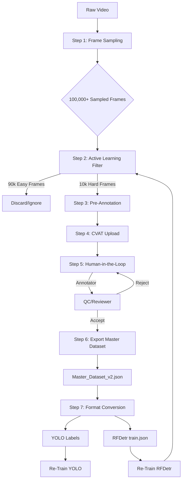

# 🚀 Proprietary AI Data Engine

> **The Active Learning & Annotation Pipeline for Industrial Safety AI**  
> *Building an unbeatable dataset, one frame at a time.*

**Project Lead:** Manmohan Vishwakarma  
**Status:** v1.0 (Planning & Architecture)

---

## 📖 Table of Contents

- [Vision](#-vision)
- [Why This Matters](#-why-this-matters)
- [Architecture](#-architecture)
- [Tech Stack](#%EF%B8%8F-tech-stack)
- [Project Structure](#%EF%B8%8F-project-structure)
- [Installation](#-installation)
- [Usage Guide](#-usage-guide)
- [Team Workflow](#-team-workflow)
- [Development Roadmap](#-development-roadmap)
- [Contributing](#-contributing)

---

## 🎯 Vision

This Data Engine is **our company's most valuable long-term asset**. While competitors can copy code or download public models, they cannot replicate our **proprietary, million-image, human-verified, perfectly balanced dataset**.

### Core Objectives

1. **Fix Class Imbalance** - Systematically hunt and annotate rare safety violations (no-boots, no-helmet, etc.)
2. **Maximize Efficiency** - Use Active Learning to filter 100K frames → 10K "hard" frames that actually improve the model
3. **Ensure Quality** - Implement rigorous Human-in-the-Loop (HITL) Quality Control
4. **Multi-Format Support** - Single source of truth that exports to both YOLO and RFDetr formats

---

## 💡 Why This Matters

This isn't just a dataset—it's a **competitive moat**:

- **Data Flywheel Effect:** Every annotation improves our model → Better model finds harder examples → More targeted annotations → Even better model
- **Proprietary Advantage:** Our dataset becomes increasingly unique and impossible to replicate
- **Continuous Improvement:** The AI service gets measurably smarter every week
- **Market Leadership:** Our competitors can't catch up without years of their own data collection

---

## 🏗️ Architecture

### The Data Engine Loop



### Pipeline Steps Explained

1. **Frame Sampling** - Extract unique, diverse frames from raw video using scene-change detection
2. **Active Learning Filter** - Use current model to identify "hard" examples (low confidence, missed detections)
3. **Pre-Annotation** - Generate initial bounding boxes to speed up human annotation
4. **CVAT Upload** - Automatically create tasks and upload frames with pre-annotations
5. **Human-in-the-Loop** - Annotators correct/complete annotations; Reviewers validate quality
6. **Export & Merge** - Consolidate accepted annotations into master dataset
7. **Format Conversion** - Generate training-ready files for YOLO and RFDetr

---

## 🛠️ Tech Stack

| Component | Technology |
|-----------|-----------|
| **Core Language** | Python 3.9+ |
| **Frame Extraction** | ffmpeg, opencv-python |
| **Scene Detection** | SSIM (Structural Similarity Index) |
| **Pre-annotation Model** | RFDetr (onnxruntime-gpu / PyTorch) |
| **Annotation Platform** | CVAT (self-hosted) |
| **Database** | PostgreSQL (via Docker) |
| **Automation** | Python requests library + CVAT REST API |
| **Deployment** | Docker / Docker Compose |

---

## 🗂️ Project Structure

```
data_engine/
│
├── docker-compose.yml              # CVAT deployment configuration
│
├── videos_raw/                     # INPUT: Raw CCTV/YouTube footage
│   └── cctv_feed_01.mp4
│
├── frames_sampled/                 # OUTPUT 1: All extracted frames (~100K)
│   ├── frame_00001.jpg
│   └── frame_00002.jpg
│
├── frames_hard_to_annotate/        # OUTPUT 2: Active learning results (~10K)
│   └── frame_00003.jpg
│
├── preannotations/                 # OUTPUT 3: AI-generated COCO files
│   └── hard_frames_preanno.json
│
├── cvat_exports/                   # OUTPUT 4: Human-corrected exports
│   └── task_1_corrected.json
│
├── master_dataset/                 # OUTPUT 5: Single source of truth
│   ├── master_dataset_v2.json
│   ├── train.json
│   └── valid.json
│
├── final_labels/                   # OUTPUT 6: Training-ready labels
│   └── yolo/
│       ├── train/
│       └── valid/
│
└── scripts/
    ├── 01_sample_frames.py             # Video → Frames
    ├── 02_run_active_learning_filter.py # Frames → Hard Frames
    ├── 03_generate_preannotations.py   # Hard Frames → COCO JSON
    ├── 04_manage_cvat_tasks.py         # Upload to CVAT
    ├── 05_export_and_merge.py          # CVAT → Master Dataset
    └── 06_convert_to_yolo.py           # COCO → YOLO format
```

---

## 📦 Installation

### Prerequisites

- Docker & Docker Compose
- Python 3.9+
- NVIDIA GPU (for pre-annotation inference)
- 100GB+ storage for datasets

### Step 1: Clone Repository

```bash
git clone <repository-url>
cd data_engine
```

### Step 2: Deploy CVAT

```bash
# Download CVAT's official docker-compose file
wget https://raw.githubusercontent.com/opencv/cvat/develop/docker-compose.yml

# Start CVAT services
docker-compose up -d

# Create admin account
docker exec -it cvat_server bash -c "python manage.py createsuperuser"
```

### Step 3: Install Python Dependencies

```bash
pip install -r requirements.txt
```

**requirements.txt:**
```
opencv-python>=4.5.0
numpy>=1.21.0
requests>=2.26.0
onnxruntime-gpu>=1.10.0  # or torch>=1.10.0
pycocotools>=2.0.4
tqdm>=4.62.0
```

---

## 🚀 Usage Guide

### Phase 1: Extract Frames

```bash
python scripts/01_sample_frames.py \
    --input videos_raw/ \
    --output frames_sampled/ \
    --method scene-change \
    --threshold 0.85
```

### Phase 2: Apply Active Learning Filter

```bash
python scripts/02_run_active_learning_filter.py \
    --input frames_sampled/ \
    --model models/rfdetr_best.onnx \
    --confidence-threshold 0.4 \
    --output hard_frames.txt
```

### Phase 3: Generate Pre-Annotations

```bash
python scripts/03_generate_preannotations.py \
    --frames hard_frames.txt \
    --model models/rfdetr_best.onnx \
    --output preannotations/hard_frames_preanno.json
```

### Phase 4: Create CVAT Task

```bash
python scripts/04_manage_cvat_tasks.py \
    --task-name "Batch_01_CCTV" \
    --frames frames_hard_to_annotate/ \
    --preannotations preannotations/hard_frames_preanno.json \
    --assignee annotator@company.com
```

### Phase 5: Export from CVAT (After Human Annotation)

```bash
python scripts/05_export_and_merge.py \
    --task-id 123 \
    --output master_dataset/master_dataset_v2.json
```

### Phase 6: Convert to YOLO Format

```bash
python scripts/06_convert_to_yolo.py \
    --input master_dataset/train.json \
    --output final_labels/yolo/train/
```

---

## 👥 Team Workflow

### Roles & Responsibilities

**🧑‍💻 AI Lead (Manmohan)**
- Develop and maintain all Python scripts
- Manage CVAT server and infrastructure
- Act as final QC Reviewer for data quality
- Execute model re-training pipelines

**🎨 Web/Design Leads**
- Serve as secondary QC Reviewers
- Validate annotation consistency

**👨‍🏫 Freelancers/Junior Team**
- Work as Annotators in CVAT
- Correct pre-annotations and add missing labels

### Annotation Workflow

1. **Annotator receives task** → Opens assigned batch in CVAT
2. **Corrects AI predictions** → Fixes bounding boxes, adds missing objects
3. **Marks complete** → Submits task for review
4. **Reviewer validates** → Accepts or rejects with feedback
5. **Accepted data** → Automatically merged into master dataset
6. **Model retraining** → New data improves next iteration

---

## 📅 Development Roadmap

### ✅ Phase 1: Setup (One-Time)
- [ ] Deploy CVAT with Docker
- [ ] Create user accounts (Admin, Annotators, Reviewers)
- [ ] Configure PostgreSQL database
- [ ] Set up directory structure

### 🔄 Phase 2: Core Scripts (In Progress)
- [ ] `01_sample_frames.py` - Keyframe extraction
- [ ] `02_run_active_learning_filter.py` - Uncertainty filtering
- [ ] `03_generate_preannotations.py` - COCO JSON generation
- [ ] `04_manage_cvat_tasks.py` - CVAT API automation
- [ ] `05_export_and_merge.py` - Dataset consolidation
- [ ] `06_convert_to_yolo.py` - Format conversion

### 🔁 Phase 3: Production Loop (Ongoing)
- [ ] Annotate Batch 01 (10K frames)
- [ ] QC and export validated data
- [ ] Retrain YOLO + RFDetr models
- [ ] Measure performance improvement
- [ ] Repeat with Batch 02

---

## 🤝 Contributing

### Code Style
- Follow PEP 8 conventions
- Add docstrings to all functions
- Include error handling and logging

### Testing New Scripts
```bash
# Test with small sample first
python scripts/01_sample_frames.py --input test_video.mp4 --output test_frames/ --limit 100
```

### Commit Message Format
```
[SCRIPT] Brief description

- Detailed change 1
- Detailed change 2
```

---

## 📞 Support

**Technical Issues:** Contact Manmohan Vishwakarma  
**CVAT Access:** Email admin@company.com  
**Annotation Questions:** Refer to CVAT documentation

---

## 📄 License

Proprietary - Internal Use Only  
© 2024 [Company Name]. All rights reserved.

---

**Remember:** Every annotation you make improves our AI. Every correction trains our model to be smarter. This isn't just data entry—you're building our competitive advantage. 🚀